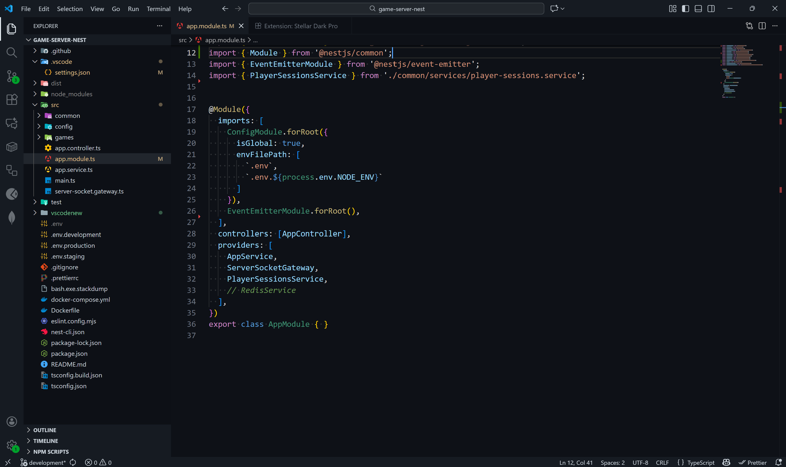

# Stellar Dark Pro 🌌

A sleek and modern dark theme for Visual Studio Code with subtle blues and elegant contrasts.  
Perfect for late-night coding sessions.

## Screenshots
<!--  -->

## Installation
1. Open **Extensions** in VS Code.
2. Search for **Stellar Dark Pro**.
3. Click **Install**.

Enjoy coding in the Stellar! 🚀
